> **Malicious** **Network** **Traffic**
>
> **Analysis** **Using** **Wireshark:** **A** **Walkthrough**
>
> [Kush
> Borikar](https://medium.com/@borikarkush?source=post_page---byline--91a1c3a258fe--------------------------------)

> In this blog post, we will explore how to analyze malicious
>
> network traffic using Wireshark, one of the most powerful tools
>
> for packet analysis. This walkthrough is inspired by practical
>
> network forensics techniques and will guide you step-by-step to
>
> identify malware in network traffic. Let’s dive into the fascinating
>
> world of network traffic analysis!

> Wireshark
>
> **Prerequisites**
>
> Before we begin, ensure you have the following:
>
> ● **Wireshark**: Download and install the latest version
>
> from <u>[Wireshark’s official
> website](https://www.wireshark.org/).</u>
>
> ● **Sample** **PCAP** **file**: You can obtain the sample
>
> malicious traffic PCAP file we are going to use, from
>
> <u>[here](https://github.com/AlexisAhmed/Wireshark-Traffic-Analysis).</u>
>
> ● Basic understanding of network protocols such as
>
> HTTP, DNS, and TCP/IP.
>
> **Steps**

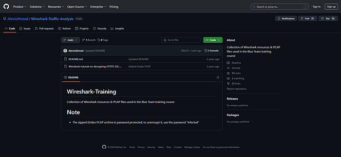

> **Step** **1-** First, we start by downloading the zip archive from
> the
>
> **GitHub** repository above and extract it. The password for the
>
> file is “***infected***”.
>
> GitHub repository by Alexis Ahmed to download the PCAP file.
>
> **Step** **2-** Once we have the PCAP file, we load it into Wireshark
>
> for further analysis. Once loaded, we’ll see a summary of all
>
> captured packets, including source and destination IP addresses,
>
> protocols, and other details.

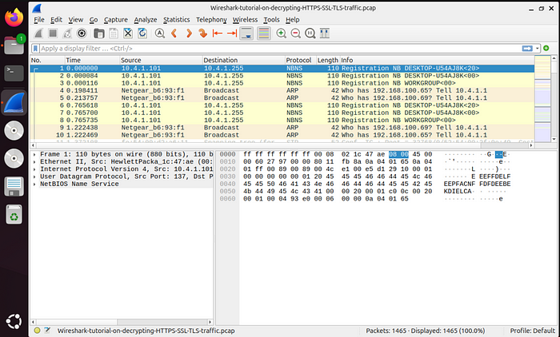

> **Step** **3-** The objective here is to decrypt communication between
>
> systems to try and identify any malicious traffic. First we will
>
> look at successful TLS handshakes in our network capture.
>
> We will use this Wireshark filter to list out successful TLS
>
> handshake-

*“tls.handhshake.type* *eq* *1”*

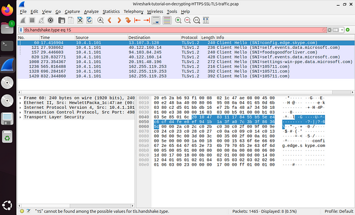

> This lists out the successful TLS handshakes in our network
>
> capture.
>
> **Step** **4-** We further investigate the handshakes by following the
>
> TLS stream to find out that the traffic is encrypted.

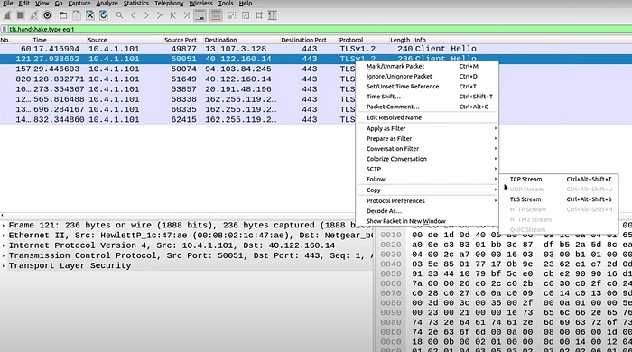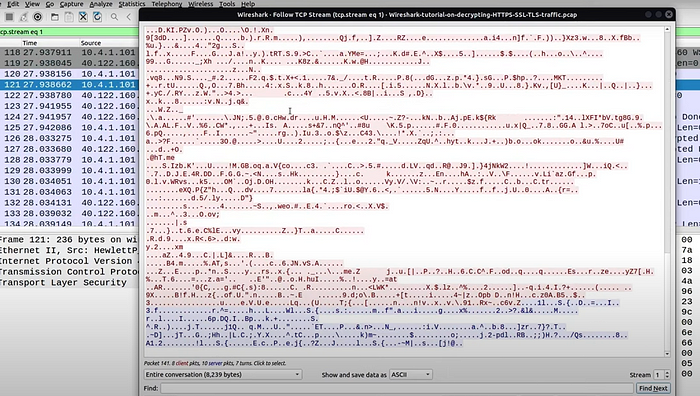

> Encrypted traffic
>
> Since the traffic is encrypted we will need the SSL keys to decrypt
>
> the requests. The SSL key are provided in the zip archive which
>
> are supposedly captured during a <u>[Man in the Middle
> attack](https://www.fortinet.com/resources/cyberglossary/man-in-the-middle-attack).</u>
>
> **Step** **5-** Navigate to the extracted archive and take a look at
> the
>
> 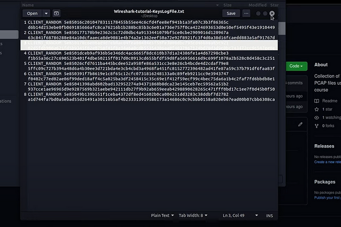SSL
> keys file name- “Wireshark-tutorial-KeysLogFile.txt”

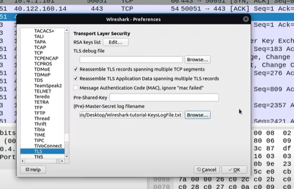

> **Step** **6-** Navigate back to Wireshark and then go to Edit \>
>
> Preferences.
>
> Under protocols, scroll down to TLS and then add the SSL key to
>
> the (Pre)-Master-Secret log filename.
>
> Once we have added the key, we can navigate back to Wireshark
>
> and perform **Step** **4** again to see that our traffic has been

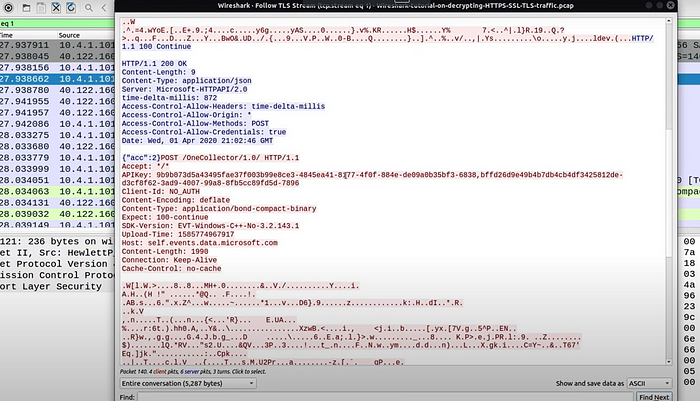

> decrypted. Now we can see the HTTP requests made and that
>
> gives us more insight for our investigation.
>
> **Step** **7-** Now we will craft a filter that will help us narrow
> down
>
> our capture to specific HTTP requests and TLS handshakes, in
>
> this case successful ones. So that we can identify which request
>
> was a malicious one and led to the infection of our system.

*(http.request* *or* *tls.handshake.type* *eq* *1)* *and* *!(ssdp)*

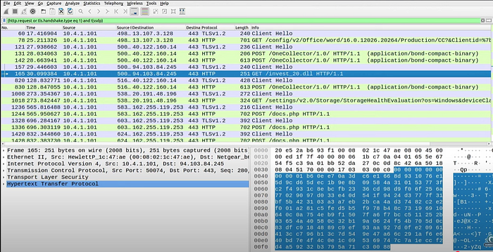

> If we look at the results carefully, we notice that there is an
>
> unusual GET request that is being made by a system on our
>
> internal network to an unusual resource — “***invest_20.dll***”
>
> which receives a code 200 response, meaning that it was
>
> downloaded on the system that requested it.
>
> What flags this request as suspicious is the resource requested by
>
> it, which is a .dllfile. A.dllfile is a shared library that contains
>
> reusable code and data, allowing multiple programs to use its
>
> functions and resources, promoting code reusability, efficiency,
>
> and modularity. Now this file type is not inherently suspicious,
>
> but it being downloaded on a system is.
>
> Since this file type is not something that users usually download
>
> to complete their daily tasks. This instance can be flagged as
>
> suspicious. Another indicator that makes this request interesting
>
> is the source port the request is initiated from- 50074. This port
>
> number does not belong to the range that is usually used by
>
> computer applications over the network.
>
> **Step** **8-** Since these indicators raise suspicions, we will
>
> investigate further by exporting this file as an object by using
>
> Wireshark’s “Export Objects” functionality that allows us to
>
> download the suspicious file “***invest_20.dll***”.

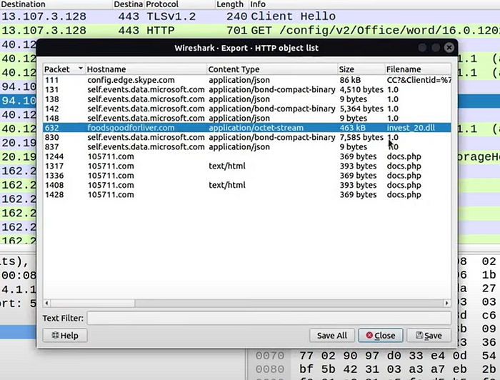

> **Step** **9-** Now that the file is saved, we can utilize a service
> like
>
> [<u>VirusTotal</u>](https://www.virustotal.com/gui/home/upload)
> <u>t</u>o perform an analysis on our potentially malicious
>
> file.

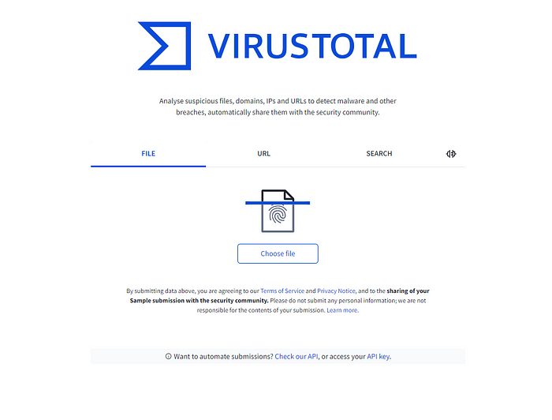

> **Step** **10-** We now perform a file upload of the
> “***invest_20.dll***”
>
> file to VirusTotal and analyze the results generated.

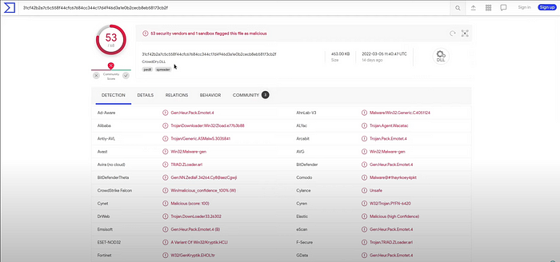

> The results indicate that this is a
> [***<u>Dridex</u>***](https://www.cisa.gov/news-events/cybersecurity-advisories/aa19-339a)
> <u>m</u>alware. Dridex is a
>
> sophisticated banking trojan, also known as Bugat or Cridex,
>
> designed to steal sensitive information from victims, including
>
> login credentials, financial information, and personal data.
>
> If we take a deeper dive into the report generated by VirusTotal
>
> we can see that this type of malware is usually delivered using
>
> Phishing emails that have Microsoft office documents as
>
> attachments and contain malicious
> [**<u>Macros</u>**](https://www.blumira.com/glossary/malicious-macro)
> that execute when
>
> the document is opened.
>
> We can assume that a user received a document through some
>
> channel with a malicious macro, which was executed and
>
> subsequently executed code to download the malware onto the
>
> system and was successful in doing so!
>
> **Step** **11-** Observing the network traffic after the malware was
>
> downloaded, we can notice several POST requests being made to
>
> 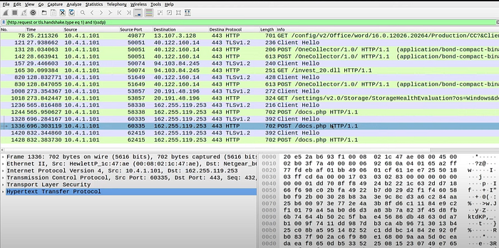an
> unusual IP address that could potential be a ***[<u>C2
> Server</u>](https://www.sentinelone.com/cybersecurity-101/threat-intelligence/what-are-command-control-c2-servers/).***
>
> These are successful **exfiltration** attempts, that are exporting
>
> potentially sensitive company data to the attacker’s C2 server.
>
> Step 12- We identify the system which was infected by using the
>
> IP address from the network capture- **10.4.1.101,** and then
>
> filtering the network traffic by using the “**nbns**” Wireshark
> filter.
>
> The NBNS (NetBIOS Name Service) protocol is a networking
>
> protocol designed to resolve NetBIOS names to IP addresses on a
>
> 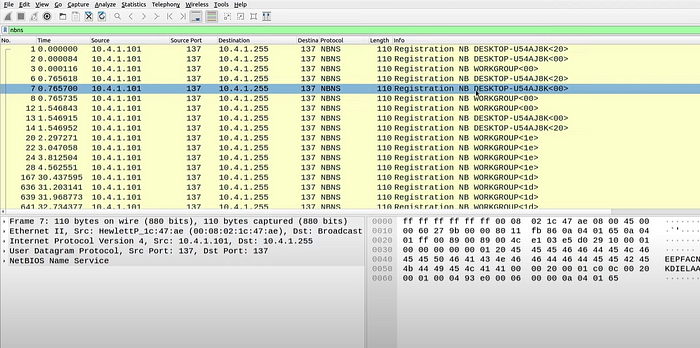local
> area network (LAN).
>
> We can see that the infected system is “**DESKTOP-U54AJ8K**”.
>
> And now further steps can be taken to isolate the infected system
>
> and prevent the malware from spreading and causing more
>
> damage.
>
> **Conclusion.**
>
> This walkthrough highlights how Wireshark can be used to
>
> detect and analyze malicious network activity. By decrypting
>
> traffic, identifying anomalies, and correlating indicators, we can
>
> uncover critical insights into an attack.
>
> Wireshark’s powerful filtering and analysis capabilities make it
>
> an essential tool for network defenders. Regular practice with
>
> real-world scenarios like this sharpens forensic skills and
>
> enhances ability to respond to cybersecurity incidents.
>
> **Acknowledgments**
>
> Special thanks to Alexis Ahmed for providing the sample
>
> malicious PCAP file used in this tutorial. You can find more
>
> resources and tutorials on his GitHub
> <u>[here](https://github.com/AlexisAhmed).</u>
